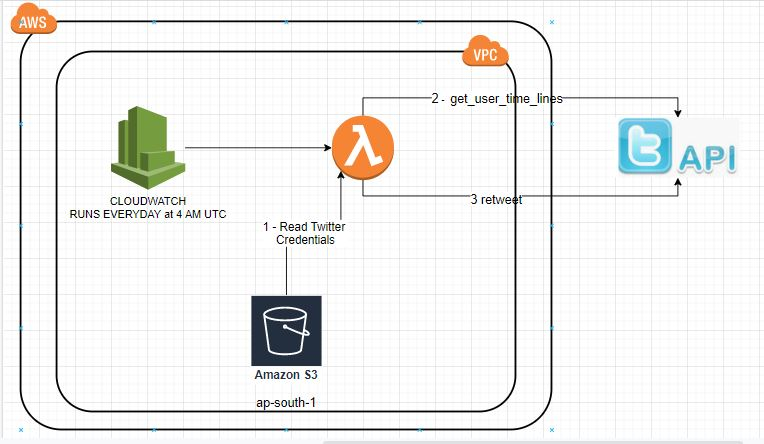
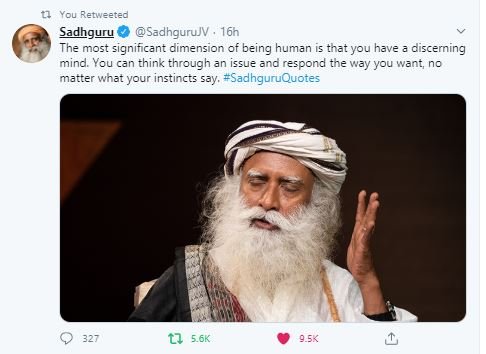

# AUTOMATED-RETWEET-BOT

# Description : 
 This bot has been created to simply and reduce the work in retweet a tweet from a existing twitter user.
 
# Solution Overview
The project is hosted on AWS Cloud infra in the form of serverless components. Automated tweet bot is a stateless software bot which meant to handle the below functionalities on behalf of the twitter user thereby reducing the work of twitter user spending time in opening the twitter app from his mobile app/ desktop application. There is a need to build a autoamted tweet bot so that it can be scheduled to invoke the twitter api on a daily basis at a specified time.

# Use-Case Constraints
- Solution to be build in AWS Cloud
- Solution to be serverless
- Solution can use any open source library wherever applicable.

# RETWEET Serverless Service
Auto Retweet serverless bot runs for every day at morning 4 AM at UTC timezone ( IST 8.30 AM) 30 mins and retrieves the given user timeline from 
his/her twitter account using twython API Python library. Bot accepts the below parameters to operate
- retweet_from_user_id : Twitter User Id from which you have to re-tweet a tweet. Hashtag will be used to filter the tweet in you are interested from the user timeline list
- time_line_count : User Time line count to retrieve to user time line of the given user( eg : If you pass 5, it will be retrieve the top 5 user time line from a given user a
- tweet_hashtag : Hashtag associated with the tweet which you want to re-tweet in case if any. Ind then from the results obtained, bot will identify the tweet which you are intereste)

Eg : If you are following twitter user ( Mr. XYZ ) who tweets a quote everyday with a hashtag, this bot can help you in finding that tweet using the twitter username,hashtag and can help you in re-tweeting the tweet from your twitter user account. Considering the person you follow and his/her tweet activity, you can configure the CRON timings at your convienence.
# Using twython to integrate with twitter
- You should have a valid twitter account
- Register your twitter account with twitter developer portal (https://developer.twitter.com)
- Set up a twitter app in developer api portal. This step will give you the below credentials.
    1. Consumer Credentials: Below two secrets are sufficient in order to retrieve the twitter data
        a. Consumer Key 
        b. Consumer Key Secret
     2. API Secret & API Secret Token : The below two and the consumer credentials are required in order to tweet, re-tweet and wherever posting the data to twitter is concerned.
        a. API Secret
        b. API Secret Token
- I have written a separate Python project(https://github.com/ashokb24/s3-bucket-creator) to write these secrets to my own S3 bucket. Briefly, this project can
    1. Create a S3 Bucket
    2. Upload a file to a given path with AES-256 encryption
 
 Note: Whilst I will come up with a dedicated jenkins for my usage, I have used boto3 python package in this project to interact with S3 service.

Python code to retrevies the secrets from S3
```python
    s3client = boto3.client('s3', region_name=region_name)
    fileobj = s3client.get_object(Bucket=bucket_name, Key=file_name)
    filedata = fileobj['Body'].read()
    contents = filedata.decode('utf-8')
```
Code to call Twython package to get the user time line 
```python
        twitter = Twython(app_key, app_secret, oauth_token, oauth_token_secret)

    if len(interested_hashtag) != 0:
        user_timelines = twitter.get_user_timeline(screen_name=retweet_from_user_id, count=time_line_count, trim_user="t",
                                                  exclude_replies="true", include_rts="false", tweet_mode="extended")
```
Code to iterate the usertime line and retrieve the tweet which contains the hashtag you are interested
```python
 for user_time_line in user_timelines:
            if interested_hashtag in user_time_line['full_text']:
                twitter.retweet(status="RETWEET FROM MY PERSONAL BOT ASSISTANT", id=user_time_line['id'])
```



# Results
Below is tweet I re-tweeted using this bot, where in I have re-tweeted a tweet from @SadhguruJV which has a hashtag **#SadhguruQuotes**
